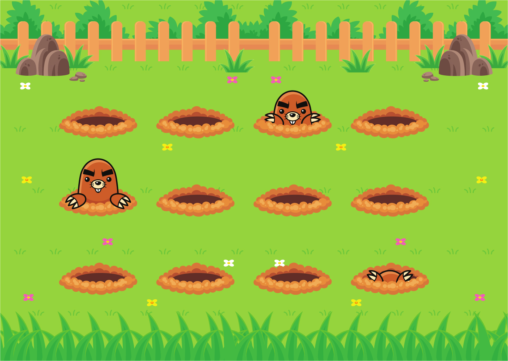

<h1 align="center"> Stage 03 - Jardim das Topeiras</h1>

 

  

## 🖥️ Tecnologias

Esse projeto foi desenvolvido com as seguintes tecnologias:

- HTML
- CSS
- Git e Github
- Figma

## 📂 Projeto

 Nesse desafio, nós vamos criar animações com keyframes em CSS para fazer as toupeiras aparecerem no campo.

 

## 🔖 Layout

Você pode visualizar o layout do projeto através [DESSE LINK](<https://www.figma.com/file/TG8ROxuGXCVVmpW4qRWdve/Wack-a-Mole-(Community)?node-id=0%3A1&t=FdzKZIQhapacnoAr-0>). É necessário ter conta no [Figma](https://figma.com) para acessá-lo.

  

